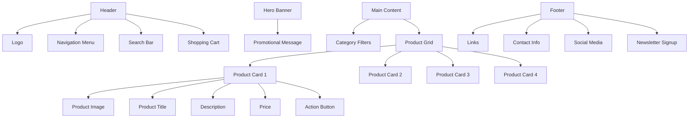

# Online Store Product Display Page Structure

This structure provides a clean, organized layout for displaying products while maintaining good usability and visual appeal. Each component serves a specific purpose:

- **Header**: Contains essential navigation elements
- **Hero Banner**: Highlights promotions or featured products
- **Main Content**: Focuses on product display with filtering options
- **Product Cards**: Present key product information in a scannable format
- **Footer**: Provides additional resources and information
